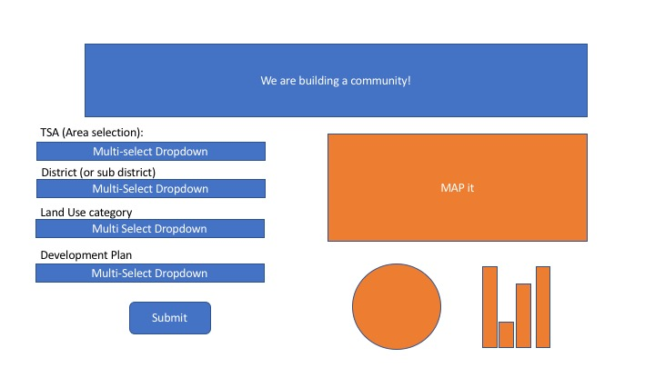
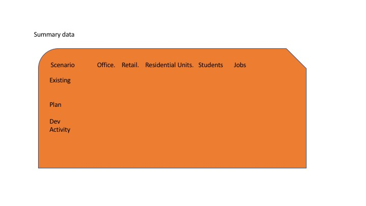

# Project2

## UCB Data Analytics visualization project.

Application for an interactive means to explore data written using combination of Python Flask, HTML/CSS Javascript, Leaflet and SQLite

### Topic 

Planning a community needs vision! Given a set of potential plans and a long term goal for a community, we want to help visualize the effect the proposed plans have
on the community and how close it approach the long term objectives set by the city planners.

This app will allow the user to navigate through the set of proposed plans and have a visual on the effect on communities staples like housing, schools, shops and businesses... 

### Dataset

We are using Fairfax County's Tax Records, Comprehensive Plan Buildout and development pipeline data.

### Inspiring visualizations

Interactive web pages are a fun way to show cause and effect. We are looking at flowingdata sites such as :

- https://flowingdata.com/2018/01/23/the-demographics-of-others/

- https://flowingdata.com/2016/08/09/household-types-then-and-now/

Other visuals are <TO BE ADDED>

### Final sketch

<TO BE ADDED>

#### Potential draft 

